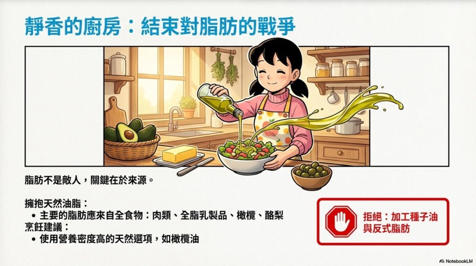

# NBLM2PPTX - Convertidor de PDF de NotebookLM a PPTX

[](https://opensource.org/licenses/MIT)
[](https://github.com/laihenyi/NBLM2PPTX/stargazers)
[](https://github.com/laihenyi/NBLM2PPTX/network/members)
[](https://github.com/laihenyi/NBLM2PPTX/issues)

Convierte PDFs exportados de NotebookLM en presentaciones PPTX con **imágenes de fondo y capas de texto editables separadas**.

[English](README.md) | [繁體中文](README-zh-TW.md) | [简体中文](README-zh-CN.md) | [日本語](README-ja.md) | [Français](README-fr.md)

## Demostración

### v2.0.2 - Eliminación de Marca de Agua

| Original (NotebookLM PDF) | Salida (PPTX Editable) |
|:-------------------------:|:----------------------:|
|  |  |

> PPTX convertido con marca de agua eliminada y capas de texto editables.

### v1.0 - Eliminación de Texto con IA

| Antes (NotebookLM PDF) | Después (PPTX Editable) |
|:----------------------:|:-----------------------:|
|  |  |

> Izquierda: PDF original de NotebookLM (texto incrustado en imagen)
> Derecha: PPTX convertido con fondo limpio + capas de texto editables

## Novedades en v2.0

### Aviso Importante (v2.0.1)

Dado que la IA de reconocimiento de imágenes determina la calidad del resultado, **no se recomienda convertir muchas páginas a la vez**. Para obtener resultados óptimos, procese **5 páginas o menos por lote**.

### Procesamiento Paralelo

La eliminación de texto y el reconocimiento OCR ahora se ejecutan simultáneamente, reduciendo significativamente el tiempo de procesamiento para fuentes de imagen.

### Procesamiento por Lotes con Protección de Límite de Velocidad

Las páginas se procesan en lotes de 3 con un período de enfriamiento de 6 segundos entre lotes, reduciendo los errores API 429 al procesar PDFs grandes.

### Respaldo OCR para PDFs

Detecta automáticamente PDFs sin capa de texto extraíble (como exportaciones de NotebookLM) y recurre a OCR, garantizando la generación de capa de texto para todos los tipos de PDF.

### Estabilidad Mejorada

- Eliminación de texto mejorada con mejor preservación de elementos no textuales
- Validación añadida para omitir resultados OCR inválidos
- Manejo de errores más robusto para casos extremos

## Características

- **Eliminación de Texto con IA**: Usa Gemini 2.5 Flash para eliminar automáticamente el texto de las imágenes y reconstruir los fondos
- **Extracción de Texto Híbrida**: Fuentes PDF usan extracción nativa de PDF.js para coordenadas precisas; fuentes de imagen usan Gemini OCR mejorado
- **Capas Separadas**: El PPTX exportado contiene imágenes de fondo y texto como capas independientes para facilitar la edición
- **Procesamiento por Lotes**: Soporta el procesamiento de múltiples páginas PDF o imágenes a la vez
- **Selección de Páginas**: Selecciona libremente qué páginas procesar, ahorrando tiempo y cuota de API

## Uso

### Usando en Google Gemini Canvas

1. Abre [Google Gemini](https://gemini.google.com/)
2. Ingresa un prompt como:
   ```
   Ejecutar directamente, no modificar
   ```
3. Cuando Gemini entre en **modo Canvas** (aparece el editor de código en el lado derecho)
4. Pega el código completo del `index-es.html` del proyecto (o tu versión de idioma preferida) en Canvas
5. Haz clic en el botón "**Preview**" en la esquina superior derecha de Canvas para ejecutar

### Configuración de API Key

> **Importante**: Al ejecutar en el entorno de Gemini Canvas, **no se requiere API Key personal**. El sistema usará automáticamente el entorno de API predeterminado.

Si deseas ejecutar la herramienta fuera de Canvas (por ejemplo, en tu propio servidor), encuentra la siguiente línea en el código e ingresa tu Gemini API Key:

```javascript
const apiKey = "TU_GEMINI_API_KEY";
```

> Obtener una API Key: Visita [Google AI Studio](https://aistudio.google.com/app/apikey)

## Flujo de Trabajo

```
┌─────────────┐    ┌─────────────┐    ┌─────────────┐    ┌─────────────┐
│  Subir PDF  │ -> │ Seleccionar │ -> │  Proceso IA │ -> │Exportar PPTX│
│  o Imágenes │    │   Páginas   │    │Eliminar Text│    │  Fondo+Text │
└─────────────┘    └─────────────┘    └─────────────┘    └─────────────┘
```

### Paso 1: Subir Archivos
- Arrastra y suelta o haz clic para subir PDFs exportados de NotebookLM
- También soporta formatos de imagen JPG, PNG, WebP
- Se pueden subir múltiples archivos a la vez

> **Consejo**: Los PDFs exportados de NotebookLM pueden ser bastante grandes. Puede usar servicios gratuitos de compresión de PDF para reducir el tamaño del archivo antes de subir, lo que mejorará mucho la eficiencia.

### Paso 2: Seleccionar Páginas
- El sistema genera automáticamente miniaturas de todas las páginas
- Marca las páginas que deseas procesar (todas seleccionadas por defecto)
- Haz clic en "Iniciar Procesamiento" para continuar

### Paso 3: Procesamiento IA
- Gemini elimina el texto de cada página y reconstruye el fondo
- El progreso se muestra en tiempo real
- Cada página toma aproximadamente 3-5 segundos (incluyendo latencia de API)

> **Nota**: La eliminación de texto de Gemini puede ser incompleta a veces. Si nota demasiado texto residual, puede intentar procesar nuevamente.

### Paso 4: Exportar PPTX
- Selecciona la proporción de la presentación (16:9 / 9:16 / 4:3)
- Haz clic en "Exportar PPTX" para descargar
- El posicionamiento de texto usa estrategia híbrida:
  - **Fuentes PDF**: Usa coordenadas pre-extraídas de PDF.js (instantáneo, sin llamada API)
  - **Fuentes de imagen**: Usa Gemini OCR con detección de estilo mejorada

## Estructura de Salida

Cada diapositiva en el PPTX exportado contiene:

| Capa | Contenido |
|------|-----------|
| Inferior | Imagen de fondo limpia con texto eliminado |
| Superior | Cuadros de texto editables (posicionados según el texto original) |

Esta estructura en capas te permite:
- Modificar fácilmente el contenido del texto
- Cambiar fuentes, colores y tamaños
- Ajustar posiciones del texto
- Preservar el estilo de diseño original

## Especificaciones Técnicas

| Elemento | Descripción |
|----------|-------------|
| Modelo IA | Gemini 2.5 Flash (Image Edit + Text Gen) |
| Eliminación de Texto | Prompt optimizado para eliminación completa con inpainting |
| Análisis PDF | PDF.js 3.11.174 |
| Generación PPTX | PptxGenJS 3.12.0 |
| Resolución de Renderizado | Miniatura 0.5x / Procesamiento 2.0x |
| Formatos Soportados | PDF, JPG, PNG, WebP, BMP |
| Extracción de Texto | Híbrido: PDF.js nativo (PDF) / Gemini OCR (Imágenes) |

## Notas

1. **Cuota de API**: Eliminación de texto usa Gemini API; extracción de texto PDF es procesamiento local (sin costo API)
2. **Límite de Velocidad**: El sistema espera automáticamente y reintenta en errores 429
3. **Tiempo de Procesamiento**: Para grandes cantidades de páginas, considera procesar en lotes
4. **Red**: Requiere conexión a internet estable
5. **Navegador**: Se recomienda Chrome o Edge (última versión)
6. **Ventaja PDF**: Fuentes PDF exportan más rápido con posicionamiento de texto más preciso

## Preguntas Frecuentes

### P: ¿Por qué usar Gemini Canvas?
R: El modo Canvas proporciona un entorno sandbox seguro para ejecutar código frontend sin configurar un servidor. Además, usa el entorno de API predeterminado, por lo que no se necesita API Key personal.

### P: ¿Qué hacer si el procesamiento falla?
R: Causas comunes:
- API Key inválida o expirada (al ejecutar fuera de Canvas)
- Conexión de red inestable
- Imagen demasiado grande o formato no soportado
- Límite de velocidad de API excedido (esperar y reintentar)

### P: ¿Se puede usar sin conexión?
R: No, esta herramienta requiere llamadas a Gemini API para el procesamiento IA.

## Versiones de Idioma

| Idioma | Archivo |
|--------|---------|
| 繁體中文 | `index.html` |
| English | `index-en.html` |
| Español | `index-es.html` |
| 日本語 | `index-ja.html` |
| Français | `index-fr.html` |
| 简体中文 | `index-zh-CN.html` |

## Licencia

MIT License
