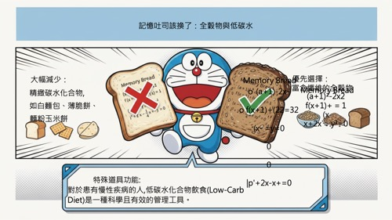

# NBLM2PPTX - NotebookLM PDF to PPTX Converter

[](https://opensource.org/licenses/MIT)
[](https://github.com/laihenyi/NBLM2PPTX/stargazers)
[](https://github.com/laihenyi/NBLM2PPTX/network/members)
[](https://github.com/laihenyi/NBLM2PPTX/issues)

Convert NotebookLM exported PDFs into PPTX presentations with **separated background images and editable text layers**.

> ✨ **Updated (2026-01-21)**: v2.2.1 Release - Complete i18n Overhaul! All language versions now feature professional light theme design with improved UX and standardized documentation.

[繁體中文](README-zh-TW.md) | [简体中文](README-zh-CN.md) | [日本語](README-ja.md) | [Español](README-es.md) | [Français](README-fr.md)

## Demo

### 🎬 Product Video (40s)

**[▶ Watch Demo Video](https://laihenyi.github.io/NBLM2PPTX/demo.html)**

*[Direct Download (4.7 MB)](https://github.com/laihenyi/NBLM2PPTX/releases/download/v2.3-demo/demo-video-en.mp4)*

**Background Music**: "Happy Upbeat Ukulele" by MaxKoMusic (CC BY-SA 3.0)

### v1.1 - Hybrid Text Extraction

| Original (NotebookLM PDF) | Output (Editable PPTX) |
|:-------------------------:|:----------------------:|
|  |  |

> PDF.js native text extraction provides precise text positioning without additional API calls.

### v1.0 - AI Text Removal

| Before (NotebookLM PDF) | After (Editable PPTX) |
|:-----------------------:|:---------------------:|
|  |  |

> Left: Original PDF from NotebookLM (text embedded in image)
> Right: Converted PPTX with clean background + editable text layers

## What's New in v2.3 (2026-01-21)

### ⚡ Dual Mode OCR System
- **Lite Model (Default)**: Uses `gemini-2.5-flash-lite` for OCR, 40-50% faster with 50% API quota savings
- **Standard Model (Optional)**: Uses `gemini-2.5-flash` for full font size, weight, and color style detection
- **User Flexibility**: Switch OCR models during page selection to balance speed and quality based on your needs

### 🚀 Parallel Processing Technology
- **Simultaneous Execution**: Text removal and OCR run concurrently, no waiting
- **Reduced Processing Time**: From 3-4 seconds per page down to 2-3 seconds
- **Intelligent Fault Tolerance**: Single API failure doesn't affect the overall workflow, improving stability

### 💡 Clear Usage Guidelines
- **Lite Model Best For**: Plain text notes, meeting minutes, content drafts (when visual formatting doesn't matter)
- **Standard Model Best For**: Beautiful presentations, brand showcases, teaching slides (require visual hierarchy)
- **Transparent Limitations**: Clear communication about Lite model's inability to detect font styles

### 📊 Output Comparison

| Lite Model | Standard Model |
|:--------:|:--------:|
|  |  |

> **Lite Model**: All text uses uniform styling, no font size variation (faster, saves API quota)
> **Standard Model**: Fully preserves font size hierarchy between titles and body text (complete style detection)

---

## What's New in v2.2.1 (2026-01-21)

### 🌍 Complete i18n Overhaul
- **Professional Design Across All Languages**: Completely redesigned all language versions (English, Spanish, Japanese, French, Simplified Chinese) from dark theme to modern light theme
- **Unified Font System**: Migrated to Poppins (headings) + Open Sans (body) with language-specific fallbacks (Noto Sans JP, Noto Sans SC, etc.)
- **Professional Blue Color Scheme**: Implemented consistent #3B82F6 primary color across all versions for trust and professionalism
- **Enhanced API Key Modal**: Browser-based API Key storage with localStorage integration eliminates need for code editing
- **Collapsible UI Elements**: Added collapsible alert banner and tools section for cleaner interface

### 📚 Standardized Documentation
- **Comprehensive READMEs**: All language README files now follow 204-line comprehensive structure
- **Quick Start Guide**: Added 3-step quick start instructions for better onboarding
- **Free API Quota Details**: Clear documentation of Google Gemini's free tier (15 RPM, 1500 RPD, no credit card)
- **Complete FAQ Section**: 5 Q&A pairs covering common questions about API keys, security, failures, sharing, and offline usage

### 🎨 Design System Updates
- **Light Theme**: #F8FAFC background for better readability
- **Modern Card Layout**: Clean borders (#E2E8F0) and subtle shadows
- **Professional SVG Icons**: Replaced emoji icons with proper SVG graphics
- **Responsive Typography**: Optimized font sizes and spacing for all screen sizes

---

## What's New in v2.2 (2026-01-20)

### 🎯 Soft Reset with API Key Persistence
- **No More Re-entering**: API Key is now preserved in memory when you click "Restart"
- **Unlimited Restarts**: Process multiple batches without re-entering your API Key
- **Smart State Management**: Resets all processing state while keeping your credentials

### ⚡ Speed Optimization
- **70% Faster Processing**: Reduced inter-page delay from 3.5s to 1.0s
- **Parallel Processing**: Leverages concurrent API calls for maximum efficiency
- **Instant Reset**: Soft reset returns to initial state immediately without page reload

### 🔧 IMAGE_RECITATION Error Fix
- **Improved AI Prompt**: Enhanced prompt engineering to avoid copyright detection
- **Better Background Reconstruction**: More accurate content-aware fill results
- **Reduced Temperature**: More consistent AI behavior with temperature 0.4

### 📝 UI Improvements
- **Clearer Instructions**: Updated API Key setup guide to match actual workflow
- **Clean Reset UI**: Restored initial upload interface on reset instead of loading spinner

## Features

- **AI Text Removal**: Uses Gemini 2.5 Flash to automatically remove text from images and reconstruct backgrounds
- **Hybrid Text Extraction**: PDF sources use native PDF.js extraction for precise coordinates; image sources use enhanced Gemini OCR
- **Separated Layers**: Exported PPTX contains background images and text as independent layers for easy editing
- **Batch Processing**: Supports processing multiple PDF pages or images at once
- **Page Selection**: Freely select which pages to process, saving time and API quota

## Usage

### Quick Start (3 Simple Steps)

1. **Open the HTML file** in your browser (Chrome/Edge recommended)
2. **Follow the guided setup** to get your free API Key from Google
3. **Start processing** your PDF or images immediately!

### First-Time Setup

When you first open the application, a friendly setup wizard will guide you through:

1. **Visit Google AI Studio** - One-click link to [aistudio.google.com/apikey](https://aistudio.google.com/apikey)
2. **Create Your Free API Key** - Sign in with your Google account (no credit card required)
3. **Paste and Save** - Copy your API Key and paste it into the app

> 🔒 **Your API Key is stored securely in your browser** and never uploaded to any server.

### Free API Quota

Google Gemini API offers a generous free tier:
- **15 requests per minute**
- **1,500 requests per day**
- **No credit card required**

This is more than enough for typical daily use!

### Alternative: Using in Google Gemini Canvas (Advanced)

If you prefer to run in Gemini Canvas environment:

1. Open [Google Gemini](https://gemini.google.com/)
2. Paste the code from `01.html` into Canvas
3. Click "Preview" to run

> ⚠️ **Note**: As of January 2026, API Key is still required even in Canvas environment. The app will prompt you to set it up.

## Workflow

```
┌─────────────┐    ┌─────────────┐    ┌─────────────┐    ┌─────────────┐
│  Upload PDF │ -> │   Select    │ -> │ AI Process  │ -> │ Export PPTX │
│  or Images  │    │   Pages     │    │ Remove Text │    │ BG + Text   │
└─────────────┘    └─────────────┘    └─────────────┘    └─────────────┘
```

### Step 1: Upload Files
- Drag and drop or click to upload NotebookLM exported PDFs
- Also supports JPG, PNG, WebP and other image formats
- Multiple files can be uploaded at once

> **Tip**: NotebookLM exported PDFs can be quite large. You can use free PDF compression services to reduce file size before uploading for much better efficiency.

### Step 2: Select Pages
- System automatically generates thumbnails for all pages
- Check the pages you want to process (all selected by default)
- Click "Start Processing" to proceed

### Step 3: AI Processing
- Gemini removes text from each page and reconstructs the background
- Progress is displayed in real-time
- Each page takes approximately 3-5 seconds (including API latency)

> **Note**: Gemini text removal may sometimes be incomplete. If you notice excessive text residue, you can try processing again.

### Step 4: Export PPTX
- Select presentation ratio (16:9 / 9:16 / 4:3)
- Click "Export PPTX" to download
- Text positioning uses hybrid strategy:
  - **PDF sources**: Uses pre-extracted coordinates from PDF.js (instant, no API call)
  - **Image sources**: Uses Gemini OCR with enhanced styling detection

## Output Structure

Each slide in the exported PPTX contains:

| Layer | Content |
|-------|---------|
| Bottom | Clean background image with text removed |
| Top | Editable text boxes (positioned to match original text) |

This layered structure allows you to:
- Easily modify text content
- Change fonts, colors, and sizes
- Adjust text positions
- Preserve the original design style

## Technical Specifications

| Item | Description |
|------|-------------|
| AI Model | Gemini 2.5 Flash Image (Text Removal) + Gemini 2.5 Flash (OCR) |
| Text Removal | Optimized prompt for complete text erasure with inpainting |
| PDF Parsing | PDF.js 3.11.174 |
| PPTX Generation | PptxGenJS 3.12.0 |
| Render Resolution | Thumbnail 0.5x / Processing 2.0x |
| Supported Formats | PDF, JPG, PNG, WebP, BMP |
| Text Extraction | Hybrid: PDF.js native (PDF) / Gemini OCR (Images) |

## Notes

1. **API Quota**: Text removal uses Gemini API; PDF text extraction is local (no API cost)
2. **Rate Limiting**: System automatically waits and retries on 429 errors
3. **Processing Time**: For large numbers of pages, consider processing in batches
4. **Network**: Requires stable internet connection
5. **Browser**: Chrome or Edge (latest version) recommended
6. **PDF Advantage**: PDF sources export faster with more accurate text positioning

## FAQ

### Q: Do I need a credit card for the API Key?
A: No! Google Gemini API offers a completely free tier with no credit card required. Just sign in with your Google account.

### Q: Is my API Key safe?
A: Yes! Your API Key is stored only in your browser's localStorage and is never sent to any server except Google's official Gemini API.

### Q: What if processing fails?
A: Common causes:
- Invalid API Key (check if it starts with "AIza")
- Unstable network connection
- Image too large or unsupported format
- API rate limit exceeded (free tier: 15/min, 1500/day - wait and retry)

### Q: Can I share this tool with others?
A: Absolutely! Just share the HTML file. Each user will set up their own API Key, so everyone gets their own free quota.

### Q: Can it be used offline?
A: No, this tool requires Gemini API calls for AI processing.

## Language Versions

| Language | File |
|----------|------|
| 繁體中文 | `index.html` |
| English | `index-en.html` |
| Español | `index-es.html` |
| 日本語 | `index-ja.html` |
| Français | `index-fr.html` |
| 简体中文 | `index-zh-CN.html` |

## License

MIT License
